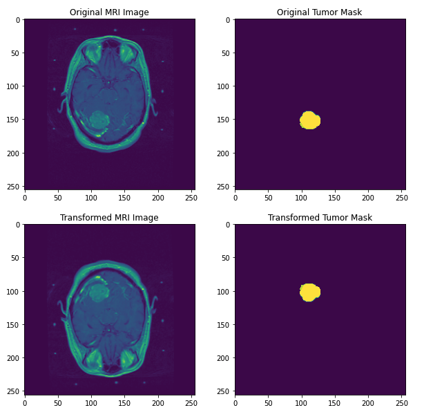

# Local-Control-Prediction

#### Team
[Anish Mukherjee](https://github.com/anmuai), [Young Zeng](github.com/youngzyx)

## Background
We worked on this project during our internship at the University of California, San Francisco. The main task for this project was to predict local control from three different types of data: image, clinical(tabular), and radiomic(tabular) data.  

`Local control`: cancer growth after stereotactic radiosurgery(binary target)  

## Dataset
`Image data` 8461 3D MRI images with brain tumors and their masks.  
`Clinical data` 8407 tableau dataset with clinical features.  
`Radiomics data` 8407 tableau dataset with radiomics features.  

 

## Methodology

We fit CNN models on the 3D MRI scans, XGBoost, and Random Forest models on the tabular data.

The imaging data was around ~ 240GB, and the model took 2-3 hours to train per epoch. The solution was to load the images onto RAM and use PyTrotchs distributed multi GPU training, which sped up execution by approximately 90%

Since the data size was large, we had memory constraints. To overcome this we decided to convert each pixel value from float32 to float16 and cropped out the borders of the image, reducing the size of the image by 70% facilatating the loading of the images onto RAM

### Results

#### Image Models
We tried different architectures of Convolutional Neural Network model such as UNet, ResNet 50. 
| Architecture|Best Accuracy|Best Area under ROC|
|:-----------|:------------:|:--------:|
|[ResNet50]()|0.8412|0.8359|

#### Models for tabular data
Since both clinical and radiomics data are tabular, it would be easier for us to model them together. We used gradient boosting model from sci-kit learn, xgboost, and random forest models.

#### Clinical Data

| Architecture|Best Accuracy|Best Area under ROC|
|:-----------|:------------:|:--------:|
|[XGBoost]()|0.8347|0.7932|
|[Random Forest]()|0.7714|0.7214|

#### Radiomic Data

| Architecture|Best Accuracy|Best Area under ROC|
|:-----------|:------------:|:--------:|
|[XGBoost]()|0.553|0.591|
|[Random Forest]()|0.521|0.572|

#### Clinical + Radiomic Data

| Architecture|Best Accuracy|Best Area under ROC|
|:-----------|:------------:|:--------:|
|[XGBoost]()|0.73|0.705|
|[Random Forest]()|0.692|0.683|

### Conclusion

The imaging model performed best on the validation data, for the next steps we could train a neural network feeding in both the clinical and the imaging data, with the imaging features extracted from the last layer of the ResNet 